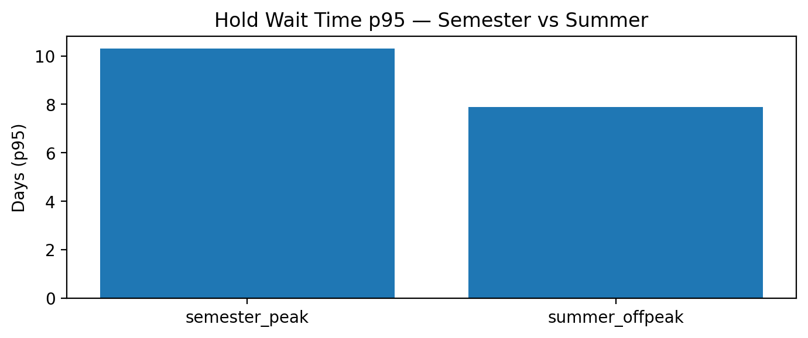
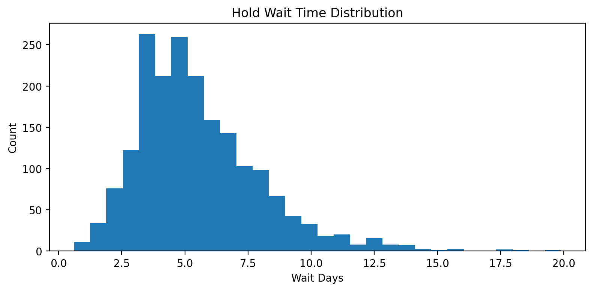
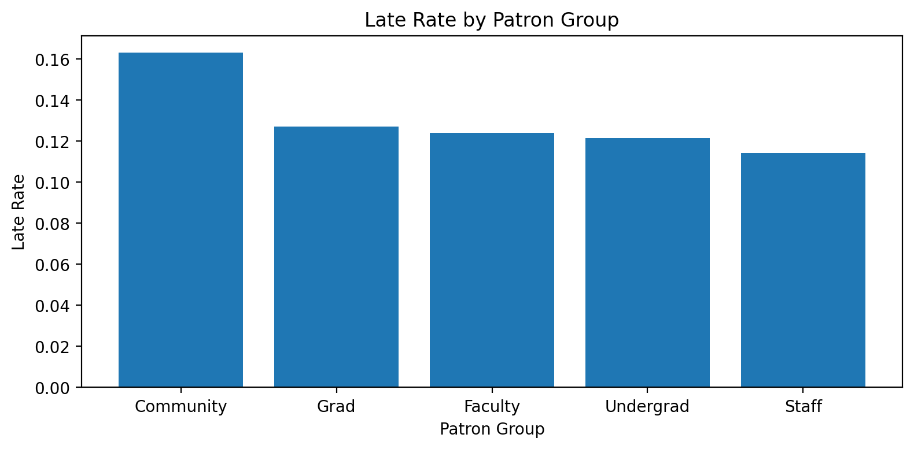

# Library Circulation Data Service MVP (Synthetic) — Main

## Goal
Build a reusable library circulation analytics & training package using synthetic data for the Main library.

## Scope
- Location: Main only
- Time range: 2024-01-01 to 2025-12-31
- Tables: items, patrons, circulation_transactions, holds (synthetic)

## Deliverables (MVP)
- 01_make_synthetic_data.ipynb: generate data + baseline KPIs
- data_dictionary.md: schema + definitions
- (Next) viz clinic notebook, light forecast, python workshop kit, outreach/web resources

## Privacy
All data is synthetic and contains no PII.

## Results — Main (Synthetic, 24 months)

**Overall KPIs**
- Transactions: 20,000
- Unique patrons: 2,996
- Late rate: 12.49%
- Renew rate: 59.53%
- Not-returned rate: 2.09%
- Avg late days (if late): 2.34 (p95 = 5)

**Who is late? (Late rate by patron group)**
- Community shows the highest late rate (~16.3%), higher than Undergrad (~12.1%) and Staff (~11.4%).
- Undergrad accounts for the majority of transactions (10,503 / 20,000), so small improvements here can move overall KPIs.

**What gets renewed? (Renew rate by collection)**
- Faculty renewal is highest (~90.5%), consistent with long-horizon research use.
- CourseReserve renewals are low (~9.8%), consistent with short-term, high-turnover policies.

## Demo Outputs

### Holds — Peak vs Summer (p95)

### Holds — Wait Time Distribution (Long Tail)

### Late Returns — By Patron Group

